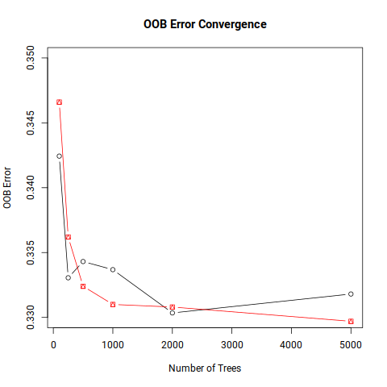

# load data

- 4798 samples
- 94485 SNPs


```{r, echo=FALSE, eval=FALSE}
library(lmtest)
library(ranger)
#library(RCy3)

#Noise <- 0.1
numIte  <-  1
t <- numIte
ntree <- 1000

dirOut  <-  paste0("Results")
if(!dir.exists(dirOut)){
  dir.create(dirOut)
}
#dirOut  <-  paste0("Results/pruned200K.3r2_geno_Missing_Averaged")
dt  <-  readRDS("pruned200K.3r2_geno_Missing_Averaged.rds")
pheno <- read.table("Cleaned_CaseControl_RAauto.fam",header=F)
pheno$ID <- paste0(pheno$V1,"_",pheno$V2)
all.equal(row.names(dt),pheno$ID)
dt <- data.frame(pheno=as.factor(pheno$V6),dt)
dim(dt) #[1]  4798 94485

#94,486 SNPs (4.46 billion possible pairwise interaction tests) and 4,798 individuals.

dt$pheno <- as.factor(dt$pheno)
#dt <- dt[which(dt$treatment=="short"),-2]

# quick load of results etc
#dirOut  <-  paste0("Results")
#load(file="Results/var_importance_gini.Rdata")
#load(file=paste0(dirOut,"/All_Interactions.Rdata"))
#load(file="./Results/interaction_snps_counts_fixed.Rdata")
#load(file=paste0(dirOut,"/lm_results_fixed.Rdata"))

```

# Random Forest Parameters

Key Parameter Effects:

-   **mtry**: Lower values of mtry lead to more different, less correlated trees, yielding better stability when
    aggregating. However, lower values of mtry also lead to trees that perform on average worse
-  **Sample size**  Similar trade-off between tree diversity and individual tree performance
- **Node size** Setting it lower leads to trees with a larger depth... computation time decreases approximately exponentially with increasing node size

Random forest is an algorithm which is known to provide good results in the default settings. @probstTunabilityImportanceHyperparameters2018,
measure the "tunability" of algorithms and hyperparameters of algorithms and conclude that random forest is far less
tunable than other algorithms such as support vector machines. Nevertheless, a small performance gain (e.g., an average
increase of the AUC of 0.010 based on the 38 considered datasets) can be achieved via tuning.

Tuning the parameter **mtry** provides the biggest average improvement of
the AUC, followed by the sample size, while the node size had only a
small effect. Changing the replace parameter from drawing with
replacement to drawing without replacement (see @stroblUnbiasedSplitSelection2007) also had a small positive effect.  

@probstHyperparametersTuningStrategies2019 comments that the number of trees in a forest is a parameter that is not tunable in the 
classical sense but should be set sufficiently high.
The convergence rate, and thus the number of trees needed to obtain optimal performance, depends on the dataset's
properties. Out-of-bag
error curves (slightly) increasing with the number of trees are occasionally observed for certain error measures. 

Using a  number of datasets, @oshiroHowManyTrees2012 and @probstTuneNotTune2017 show empirically
that the biggest performance gain can often be achieved when growing the first 100 trees. 

It is generally thought that trees are required for stable variable importance estimates than for the simple prediction
purpose. @lunettaScreeningLargescaleAssociation2004 performed simulations with more noisy variables than truly
associated covariates and concluded that multiple thousands of trees must be trained in order to get stable estimates of
the variable importance. 


Note that we are using the Gini impurity measure for variable importance. See arguments in ****

-    Much faster computation - no permutation required. 
-    Deterministic - same results every time (less affected by randomness)
-    Built into tree construction - no additional computational overhead
-  in the case of SNP random varaibles, the  
Limitations (from Probst paper): the Gini variable importance measure assigns higher importance values to variables with
more categories or continuous variables and to categorical variables with equally sized categories even if all variables
are independent of the response variable

```{R, echo=FALSE, eval=FALSE}
# Test different numbers of trees with impurity importance
tree_counts <- c(100, 250, 500, 1000, 2000, 5000)
results <- data.frame()

for(n_trees in tree_counts) {
  print(paste("Testing", n_trees, "trees"))
  
  # Time the training
  start_time <- Sys.time()
  
  rf_model <- ranger(
    dependent.variable.name = "pheno",
    data = dt,
    num.trees = n_trees,
    mtry = ncol(dt)/3,
    importance = 'impurity',
    seed = 123  # For reproducibility
  )
  
  end_time <- Sys.time()
  
  # Store results
  results <- rbind(results, data.frame(
    num_trees = n_trees,
    oob_error = rf_model$prediction.error,
    training_time = as.numeric(end_time - start_time, units = "secs"),
    top_var_importance = max(rf_model$variable.importance)
  ))
}

results<- structure(list(num_trees = c(100, 250, 500, 1000, 2000, 5000), 
    oob_error = c(0.342434347644852, 0.333055439766569, 0.334305960817007, 
    0.333680700291788, 0.330345977490621, 0.331804918716132), 
    training_time = c(217.293184995651, 437.686666965485, 794.375539779663, 
    1539.06033182144, 2960.24087452888, 7178.61296319962), top_var_importance = c(82.9423155959121, 
    86.0040477297634, 81.0779355241392, 83.3997545953136, 83.5774924785954, 
    83.5603383214029)), row.names = c(NA, -6L), class = "data.frame")


# Plot convergence
plot(results$num_trees, results$oob_error, type = "b", 
     xlab = "Number of Trees", ylab = "OOB Error",
     main = "OOB Error Convergence")


```

-  Error convergence: Should see diminishing returns after ~100-500 trees
-  Variable importance: Should stabilize but may need more trees than error
-  Computational time: Linear increase with number of trees

For Addressing Reviewer Concerns:

Since you're using impurity importance, you can argue:

    "We used impurity-based variable importance measures, which are deterministic and computationally efficient compared to permutation-based measures. While Probst et al. (2019) noted that permutation-based importance may require thousands of trees for stability in high-dimensional genomic data, impurity-based measures are less affected by this limitation as they are calculated during tree construction rather than through post-hoc permutation."


Both Gini AND Permutation Importance Have Bias Issues:

From the literature, both Gini and permutation importance suffer from bias toward variables with more categories:

We show that random forest variable importance measures are a sensible means for variable selection in many applications, but are not reliable in situations where potential predictor variables vary in their scale of measurement or their number of categories... the Gini importance shows a strong preference for variables with many categories and the continuous variable
How to Set the Number of Trees in Random Forest | Towards Data Science

And importantly: We now consider the more advanced permutation importance measure... We found that, even when the cforest function based on unbiased classification trees is used, variables with more categories are preferred when bootstrap sampling is conducted with replacement, while no bias occurs when subsampling is conducted without replacement
How to Set the Number of Trees in Random Forest | Towards Data Science
Strobl et al.'s Solution: Conditional Variable Importance

You're correct that Carolin Strobl and colleagues developed conditional variable importance to address these bias problems:

Based on these considerations we develop a new, conditional permutation scheme for the computation of the variable importance measure
11.6 Random Forest | Practitioner’s Guide to Data Science
The key insight was that We identify two mechanisms responsible for this finding: (i) A preference for the selection of correlated predictors in the tree building process and (ii) an additional advantage for correlated predictor variables induced by the unconditional permutation scheme


```{r, echo=FALSE, eval=FALSE}

set.seed(100)
#petrichor-i1: salloc -A OD-217714 --mem=100GB --nodes=1 --ntasks-per-node=64    -J interactive -t 6:00:00 srun --pty /bin/bash -l
#etrichor-i1: sacct -j 60755241  --format="jobid,ntasks,Elapsed,TotalCPU,MaxRSS,AveVMSize,MaxVMSize"
#JobID          NTasks    Elapsed   TotalCPU     MaxRSS  AveVMSize  MaxVMSize 
#60755241                00:13:56  00:06.682                                  
#60755241.ex+        1   00:13:56  00:00.001       995K    124080K    124080K 
#60755241.0         64   00:13:53  00:06.680 104545713K 3274946112 192422568K 


# this is the model that was used in the main paper
system.time(model.rf <- ranger(dependent.variable.name="pheno",data = dt,num.trees = ntree, mtry = ncol(dt)/3, importance = 'impurity'))
#     user    system   elapsed 
#89397.171     4.807  1591.941 
#save(model.rf, file="model.rf_temp3.Rdata")
var_importance <- model.rf$variable.importance
head(rev(sort(var_importance)))
t2 <-count_variables(model.rf)
names(t2) <-names(var_importance)
#save(var_importance , t2, file="Results/var_importance_gini.Rdata")
#load(file="Results/var_importance_gini.Rdata")


set.seed(123)
system.time(rf_100 <-  ranger(dependent.variable.name="pheno",data = dt,num.trees = 100, mtry = ncol(dt)/3, importance = 'impurity')) 
#     user    system   elapsed 
#8897.449    3.043  224.81
#OOB prediction error:             34.66 % 
rf_100_variable.importance <- rf_100$variable.importance

set.seed(123)
system.time(rf_100 <-  ranger(dependent.variable.name="pheno",data = dt,num.trees = 100, mtry = ncol(dt)/3, importance = 'impurity')) 
#     user    system   elapsed 
#8897.449    3.043  224.81
#OOB prediction error:             34.66 % 
rf_100_variable.importance <- rf_100$variable.importance


set.seed(123)
system.time(rf_250 <-  ranger(dependent.variable.name="pheno",data = dt,num.trees = 250, mtry = ncol(dt)/3, importance = 'impurity')) 
#     user    system   elapsed 
#21996.459     3.480   414.998
#OOB prediction error:       33.62 % 
rf_250_variable.importance <- rf_250$variable.importance


set.seed(123)
system.time(rf_500 <-  ranger(dependent.variable.name="pheno",data = dt,num.trees = 500, mtry = ncol(dt)/3, importance = 'impurity')) 
#     user    system   elapsed 
#44385.171     6.711   813.847 
#OOB prediction error:             33.24 % 
#rf_500_variable.importance <- rf_500$variable.importance

system.time(rf_1000  <-  ranger(dependent.variable.name="pheno",data = dt,num.trees = 1000, mtry = ncol(dt)/3, importance = 'impurity'))
#     user    system   elapsed 
#90550.779     7.683  1691.032 
#OOB prediction error:             33.10 % 
rf_1000_variable.importance <- rf_1000$variable.importance


system.time(rf_2000  <-  ranger(dependent.variable.name="pheno",data = dt,num.trees = 2000, mtry = ncol(dt)/3, importance = 'impurity'))
#     user     system    elapsed 
#177425.239      9.037   3496.305 
#OOB prediction error:             33.08 % 
rf_2000_variable.importance <- rf_2000$variable.importance


system.time(rf_5000  <-  ranger(dependent.variable.name="pheno",data = dt,num.trees = 5000, mtry = ncol(dt)/3, importance = 'impurity'))
#      user     system    elapsed 
#441795.347      9.380   7199.468 
#OOB prediction error:             32.97 % 
#rf_5000_variable.importance <- rf_5000$variable.importance


save(rf_100_variable.importance , rf_250_variable.importance ,rf_500_variable.importance,rf_1000_variable.importance , rf_2000_variable.importance, 
rf_5000_variable.importance , file="./script4_temp.Rdata")
load(file="./script4_temp.Rdata")

# Compare variable importance stability
cor(rf_100_variable.importance, rf_250_variable.importance)   #0.9909538
cor(rf_250_variable.importance, rf_500_variable.importance)   #0.9970955
cor(rf_500_variable.importance, rf_1000_variable.importance)   #0.9958397
cor(rf_1000_variable.importance, var_importance)  #0.9971393

aa<-cbind(rf_100_variable.importance, rf_250_variable.importance,
          rf_500_variable.importance, rf_1000_variable.importance, var_importance)
cor(aa)
#                            rf_100_variable.importance rf_250_variable.importance rf_500_variable.importance rf_1000_variable.importance
#rf_100_variable.importance                   1.0000000                  0.9909538                  0.9866379                   0.9840345
#rf_250_variable.importance                   0.9909538                  1.0000000                  0.9970955                   0.9934666
#rf_500_variable.importance                   0.9866379                  0.9970955                  1.0000000                   0.9958397
#rf_1000_variable.importance                  0.9840345                  0.9934666                  0.9958397                   1.0000000


results2 <- data.frame(num.tree=c(100, 250, 500, 1000, 2000,5000),
               OOB_prediction_error=c( 34.66 ,33.62 , 33.24 , 33.10 ,33.08,  32.97  )/100  ,
               training_time = c(8897.449, 21996.459  , 44385.171   ,   90550.779 , 177425.239 ,441795.347      )
               )
               
# Plot convergence
#png("./script3/OOB_Error_Convergence.png")
plot(results$num_trees, results$oob_error, type = "b", 
      xlab = "Number of Trees", ylab = "OOB Error",
      main = "OOB Error Convergence",ylim=c(0.33,0.35))
points(results2$num.tree, results2$OOB_prediction_error, col="red", type = "b", pch=14)
#dev.off()

head(rev(sort(t2)))
#X6_32771829 X6_32471505 X6_32682149 X6_32222493 X6_32308125 X6_32406920 
#       1532         993         277         202         190         170 


```

```{r OOBErrorConvergence, eval=TRUE, echo=FALSE, fig.cap='OOB Error Convergence',  fig.align = 'center', out.width = '50%'}

```


- things to do for parameter optimization (in the Supplementarty information)

  - we are using Gini impurity 
     
	  - show that this reasonable for SNP measurments
	  - do one timing run for permutation and one for cforest
  - do we need to optimize mtry etc 


